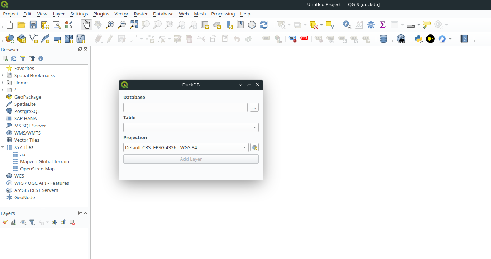

# QDuckDB - QGIS Plugin

## Descritpion

This plugin allows you to read spatial data layers from [DuckDB](https://duckdb.org/) databases in QGIS.

## Features

- A new QGIS duckdb provider is implement with this plugin
- With this provider it's only possible to read a geographic layer from DuckDB database
- Use the provider with pyqgis command line or with a graphical interface
- Not possible to edit or create features in the layer for now
- Duckdb allows you to connect to database files as well as CSV, JSON and Parquet files. For the moment, the provider only allows you to connect to a file database.

## Documentation

The documentation is generated using Sphinx and is automatically generated through the CI and published on Pages.

🇬🇧 [Check-out the documentation](https://oslandia.gitlab.io/qgis/qduckdb/)

## Credits

This plugin has been developed by Oslandia ( <http://www.oslandia.com> ).

Oslandia provides support and assistance for QGIS and associated tools, including this plugin.

This initial work has been funded by IFREMER ( <https://www.ifremer.fr/fr> ).

## License

Distributed under the terms of the [`GPLv2+` license](LICENSE).

## Further development

List of possible features in the future if funding :

- Possibility of editing tables (update and delete entities, create column, drop column.. )
- Import layer from qgis to DuckDB database
- Convert DuckDB database to GeoPackage
- Enable the provider to connect to a CSV, JSON or parquet file.

If you too, you want to contribute enhancing and developping this tool or funding a new feature, don't hesitate to contact us by [mail](mailto:infos@oslandia.comsubject=%QDuckDB%5D%20Request) or opening an issue.
