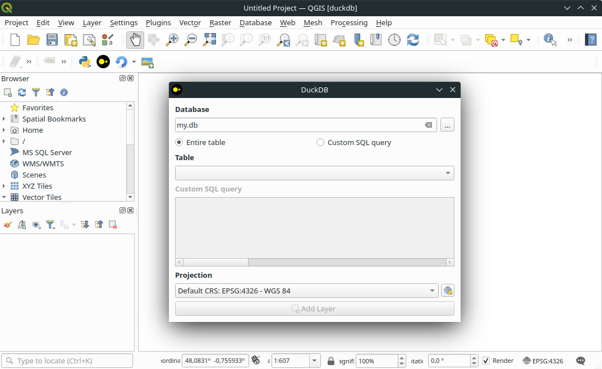

# QDuckDB - QGIS Plugin

## Description

This plugin allows you to read spatial data layers from [DuckDB](https://duckdb.org/) databases in QGIS.

DuckDB is an in-process SQL OLAP database management system, designed to be simple and portable, feature-rich, fast, free and extensible ( MIT licence ).

[QGIS](https://qgis.org) is the most dynamic OpenSource Geographical Information System platform, including the QGIS Desktop software application.

## Features

- A new QGIS DuckDB provider is implement with this plugin
- Read geographic layers from a DuckDB database
- Use the provider with pyqgis command line or through a graphical interface

## Limitations

- Read-only : with this provider it's only possible  for now to **read** a geographic layer from a DuckDB database
- It is not possible to edit or create features in the layer yet
- Duckdb allows you to connect to database files as well as CSV, JSON and Parquet files. For the moment, the provider only allows you to connect to a file database.
- This is an early release : bugs and various issues are expected to arise

## Documentation

The documentation is generated using Sphinx and is automatically generated through the CI and published on Pages.

🇬🇧 [Check-out the documentation](https://oslandia.gitlab.io/qgis/qduckdb/)

## Credits

This plugin has been developed by Oslandia ( <https://oslandia.com> ).

Oslandia provides support and assistance for QGIS and associated tools, including this plugin.

**This initial work has been funded by IFREMER** ( <https://www.ifremer.fr/fr> ) .

## License

Distributed under the terms of the [`GPL` license version 2 or later](LICENSE).

## Further development

List of foreseen features, according to available funding :

- [Write mode](https://gitlab.com/Oslandia/qgis/qduckdb/-/issues/11) : allowing edition of tables (update and delete entities, create column, drop column… )
- [Import layer from QGIS to DuckDB database](https://gitlab.com/Oslandia/qgis/qduckdb/-/issues/12)
- [Enable the provider to connect to a remote CSV, JSON or parquet file](https://gitlab.com/Oslandia/qgis/qduckdb/-/issues/14)
- [Homegeneization of widgets, better integration in QGIS](https://gitlab.com/Oslandia/qgis/qduckdb/-/issues/13) ( e.g. provider list, config window…)
- Port this plugin to QGIS Core in C++
- Convert DuckDB database to GeoPackage
- … your own needs, [create a `feature request` issue](https://gitlab.com/Oslandia/qgis/qduckdb/-/issues) !

## Contributing

Contributions are welcome ! You can contribute through :

- Testing and [giving feedback in issues](https://gitlab.com/Oslandia/qgis/qduckdb/-/issues)
- Bug reports & bug fixes
- Code for new features ( please open an issue for discussion before coding )
- Documentation

You can also contribute with **funding** if you want to support the project and see new features !

## Get in touch

Do not hesitate to contact us by [mail](mailto:infos+qduckdb@oslandia.com) or open an issue, should you have any question or want to support QDuckDB.
