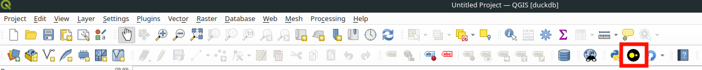
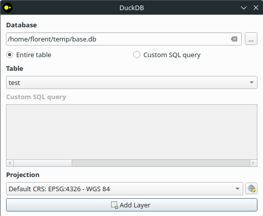
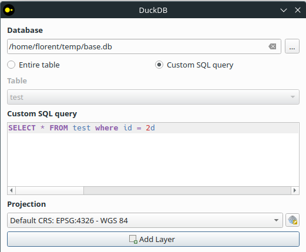
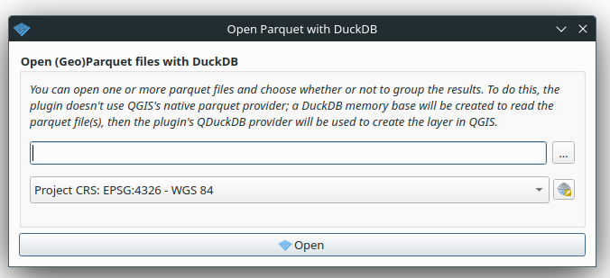

# User documentation

A video demonstration is available [here](https://vimeo.com/885148138?share=copy).

## Use the graphical interface for entire table

If the plugin is properly installed, you should see a DuckDB logo in your qgis toolbar.



Clicking on it opens a window. This window will be used to add a layer from a duckdb database



In this window you need to :

- Select a database in the field.

Once selected, this will trigger a scan of the tables, and fill in the drop-down menu in field.

- Select a table in field.

:information_source: Since `1.0.0` view and table without geometry column are also supported.

Geographic tables in DuckDB do not support projection systems. You therefore need to tell QGIS what projection the table is in field. You can leave this field blank, but in this case your layer will have no CRS and will probably be incorrectly projected in the canvas.

Then click on the add layer button, and your layer will be loaded into the canvas.

You can then do everything you're used to doing in QGIS (query features, open the attribute table, style your layer). On the other hand, you can't edit the table; it's read-only.

## Use the graphical interface for custom SQL Query

As for an entire table, you must designate the projection system if there is a spatial column.

If your SQL query uses functions from extensions, check them in the extensions drop-down menu to load them.



## Loading a layer from the command line

You can also use the plugin's command-line data provider.

In the URI, you need to provide the same things as in the UI: the base path, the table name, and the EPSG code to define the projection. Schema management has also been added via `schema="schema_name"`, but it is optional. If no schema is specified, the default is to search in the `main` schema.

Here's an example of python code you can use in the qgis python console to do this.

```python
uri = 'path="path/to/my/db.duckdb"|table="my_spatial_table"|epsg="4326"|schema="data"'
layer = QgsVectorLayer(uri, "my_table", "duckdb")
QgsProject.instance().addMapLayer(layer)
```

You can also use a custom sql query directly in the uri.

```python
uri = 'path="path/to/my/my_base.db"|sql="SELECT name, geom FROM cities WHERE id = 1"|epsg="4326"'
```

## Load geoparquet

This plugin also lets you load a geoparquet directly via the DuckDB provider.

Both local and remote parquet files can be supplied.



In detail, we create an instance of the provider with a temporary base in memory and then perform a `select * from read_parquet`.
